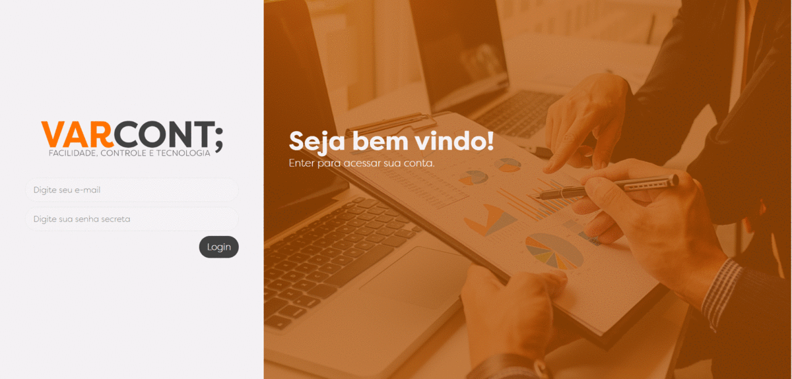

# VarCont

Projeto para Contabilidade, Engenharia de Software e Linguagem de Programação.

## Começando
Neste projeto, foi proposto a ideia de relacionar 3 matérias à uma única aplicação. No início, estavamos com pé atrás de tentar arriscar uma linguagem ao qual ninguém era ambientalizado, o Java, e utilizando o framework Spring Boot.

> Por fim, resultou em um tipo de protótipo para que possamos aprimorar a ideia sobre o app e quem sabe **joga-lo ao mercado**.

### O que encontrarei neste repositório?
Neste repositório se um programa de controle de estoques, custo médio e sistema CRUD, noções sobre orientação .

- Criação de usuários, produtos, lotes, realizações de vendas.
- Controle de estoque, custo médio e venda.
- Visualizar como funciona um projeto simples API REST em Spring Boot e HTML E CSS.

## Construído com
- HTML5 e CSS3 - Estruturar e estilizar a interface.
- Bootstrap 4 - Framework web que auxilia na interface e responsividade.
- JavaScript e JQuery - Permite o site ser dinâmico.
- AXIOS - Para realizar a conexão assíncrona.
- Spring Boot - Construção da API e controle da regra de negócios.
- MYSQL - Utilizado para criar as relações e os CRUDS.

## Como montar o ambiente?
- Primeiro terá que ter o Java instalado e MySql configurado
- Terá também que configurar o projeto do spring na sua máquina local
- Feito isso, terá que bater as senhas do seu banco de dados e criar uma database para que a ORM encontre ela no banco de dados
- Ajustando as conexões do banco de dados, só rodar o backend em Spring
- O front está conectado com o servidor e foi desenvolvido em html+css+js, então é só iniciar pelo login

## Autores
- **Vinicius Leonardo Okamoto** - [viniokamoto](https://github.com/viniokamoto/)
- **Victor Martins Tinoco** - [victrmart](https://github.com/victrmart/)
